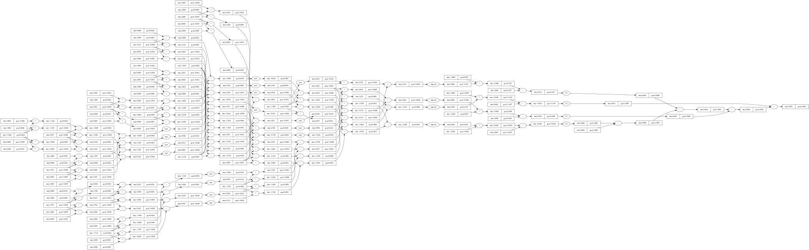

## Thank you Andrej Karpathy

I have been following along with Andrej Karpathy's
[micrograd](https://github.com/karpathy/micrograd),
a neural network built from scratch in Python with an accompanying
[video series](https://www.youtube.com/watch?v=VMj-3S1tku0). 
I recommend this very highly! My intention here is to complement that by going
into more depth in places and exploring in interesting directions.

## A simpler problem: XOR

Karpathy uses the moons dataset to demonstrate micrograd. I wanted to start with the
simplest possible problem so that I could keep the network small and visualise
everything about it. Exclusive OR (XOR) seemed to fit the bill: two binary input
neurons, four possibilities (2^2) and it requires a hidden layer, unlike AND or OR.
However even this turned out more complicated than I expected!

| Input 1 | Input 2 | Output |
|----------|----------|----------|
| 0     | 0     | 0     |
| 0     | 1     | 1     |
| 1     | 0     | 1     |
| 1     | 1     | 0     |

## Computation graph

This shows the computation graph for the loss, accumulated across the four input
cases. It surprised me how complicated this is! Backpropagation drills through this
graph from right to left, calculating the gradient of the loss with respect to the
node i.e. how much a given change in that parameter (say a neuron weight) affects
the loss.

Karpathy uses a clever trick in micrograd to reduce effort: derivatives are given
for multiplication and addition, then recycled for subtraction by expressing it as
`a - b = a + (-b)`. But it does have the side-effect of cluttering this graph.

{width=80%}

## Loss vs iterations

```{python}
import pandas as pd
import plotly.express as px

df = pd.read_csv("results.csv")

fig = px.line(
    df,
    x='iteration',
    y='loss',
    color='repeat',
    facet_col='hidden_neurons',
    facet_row='learning_rate',
    title='Loss vs Iterations'
)

fig.show()
```

## Todo

- Define one neuron: inputs, outputs, activation function, weights, bias.
- Commentary on loss vs iterations.
- Explain why hidden layer needed: linearly separable.
- Diagram of neural network.
- Further work.
